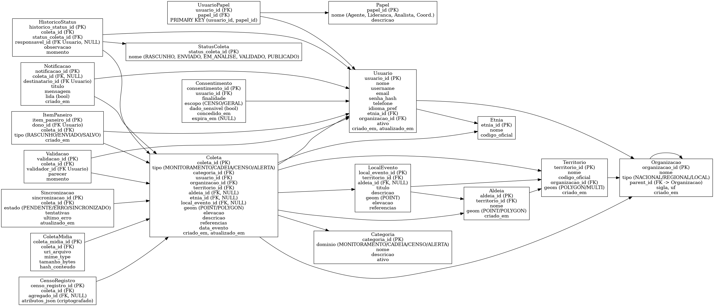

# Kutary Database

Sistema de banco de dados para monitoramento territorial indígena desenvolvido para a COIAB (Coordenação das Organizações Indígenas da Amazônia Brasileira).

## 📋 Visão Geral

O **Kutary** é uma plataforma de coleta e monitoramento de dados territoriais indígenas que permite:

- **Monitoramento Territorial**: Coleta de dados sobre aldeias, territórios e locais de interesse
- **Gestão de Cadeias Produtivas**: Acompanhamento de atividades econômicas sustentáveis
- **Censo Demográfico**: Coleta de dados populacionais com respeito à LGPD
- **Sistema de Alertas**: Detecção e notificação de eventos importantes
- **Workflow de Validação**: Processo de revisão e aprovação de coletas
- **Sincronização Offline**: Funcionalidade para trabalho em campo sem conectividade

## 🗄️ Arquitetura do Banco de Dados

### Tecnologias Utilizadas
- **PostgreSQL 14+** - Sistema de gerenciamento de banco de dados
- **PostGIS 3+** - Extensão para dados geoespaciais
- **SRID 4326** - Sistema de referência WGS84 para coordenadas geográficas

### Diagrama ERD (Entity Relationship Diagram)



*Diagrama completo das entidades e relacionamentos do banco de dados Kutary*

## 📁 Estrutura do Projeto

```
kutary_db/
├── README.md                    # Este arquivo
├── gerar_erd_kutary.py         # Script Python para gerar o diagrama ERD
├── kutary_erd_v1.png           # Diagrama ERD em formato PNG
├── kutary_erd_v1.pdf           # Diagrama ERD em formato PDF
├── kutary_ddl_migrations.zip   # Arquivo compactado com todas as migrações
└── kutary_ddl_migrations/      # Diretório com scripts de migração
    ├── README.md               # Documentação das migrações
    ├── 00_init.sql            # Inicialização do schema e extensões
    ├── 01_tables.sql          # Criação das tabelas
    ├── 02_indexes.sql         # Índices espaciais e de performance
    ├── 03_views.sql           # Views para consultas e APIs
    ├── 04_rls.sql             # Row Level Security (políticas de acesso)
    └── 05_seed.sql            # Dados iniciais (papéis e categorias)
```

## 🏗️ Principais Entidades

### 👥 Usuários e Organizações
- **Usuario**: Usuários do sistema com perfis e organizações
- **Organizacao**: Estrutura hierárquica (Nacional/Regional/Local)
- **Papel**: Definição de papéis (Agente, Liderança, Analista, Coordenador)
- **Etnia**: Identificação étnica dos usuários

### 🗺️ Território e Localização
- **Territorio**: Áreas geográficas com geometrias MultiPolygon
- **Aldeia**: Pontos ou áreas de aldeias indígenas
- **LocalEvento**: Locais específicos de eventos ou interesse

### 📊 Coleta de Dados
- **Coleta**: Entidade central para todos os tipos de coleta
- **Categoria**: Classificação por domínio (Monitoramento/Cadeia/Censo/Alerta)
- **ColetaMidia**: Arquivos multimídia associados às coletas
- **StatusColeta**: Workflow de status (Rascunho → Enviado → Em Análise → Validado → Publicado)

### 🔐 Segurança e Privacidade
- **Consentimento**: Controle de consentimento LGPD
- **CensoRegistro**: Dados sensíveis com atributos JSON criptografados
- **Row Level Security**: Políticas de acesso por organização

### 🔄 Funcionalidades Avançadas
- **Notificacao**: Sistema de notificações
- **ItemPaneiro**: Favoritos/salvos dos usuários
- **Sincronizacao**: Controle de sincronização offline
- **Validacao**: Processo de validação de coletas

## 🚀 Como Usar

### Pré-requisitos
- PostgreSQL 14 ou superior
- PostGIS 3 ou superior
- Python 3.8+ (para gerar diagramas)

### Instalação

1. **Clone o repositório**
   ```bash
   git clone <url-do-repositorio>
   cd kutary_db
   ```

2. **Crie o banco de dados**
   ```bash
   createdb kutary_db
   ```

3. **Aplique as migrações na ordem**
   ```bash
   psql -d kutary_db -f kutary_ddl_migrations/00_init.sql
   psql -d kutary_db -f kutary_ddl_migrations/01_tables.sql
   psql -d kutary_db -f kutary_ddl_migrations/02_indexes.sql
   psql -d kutary_db -f kutary_ddl_migrations/03_views.sql
   psql -d kutary_db -f kutary_ddl_migrations/04_rls.sql
   psql -d kutary_db -f kutary_ddl_migrations/05_seed.sql
   ```

### Gerando o Diagrama ERD

Para regenerar o diagrama ERD:

```bash
# Ative o ambiente virtual (se existir)
source venv/bin/activate

# Instale as dependências
pip install graphviz

# Execute o script
python gerar_erd_kutary.py
```

## 📊 Views Disponíveis

O sistema inclui views pré-configuradas para facilitar consultas:

- **v_coleta_status_atual**: Status mais recente de cada coleta
- **v_coletas_publicas**: Coletas para visualização pública
- **v_coletas_geojson**: Dados em formato GeoJSON para APIs
- **v_painel_status**: Dashboard com contagens por organização/território

## 🔒 Segurança e LGPD

- **Row Level Security (RLS)**: Controle de acesso por organização
- **Consentimento**: Sistema de consentimento para dados sensíveis
- **Criptografia**: Suporte para criptografia de dados sensíveis
- **Auditoria**: Histórico de mudanças de status e validações

## 🔧 Integração com Frameworks

### Django
```python
# Use django.contrib.gis com PostGIS
# Converta ENUMs para models.TextChoices
```

### SQLAlchemy/Alembic
```python
# Gere migrações a partir dos modelos
# Mantenha os SQLs como baseline
```

### Hasura/PostgREST
```python
# Configure current_setting('app.organizacao_id') para RLS
```

## 📈 Próximos Passos

1. **Completar taxonomias** com listas oficiais de categorias, etnias e organizações
2. **Implementar workflow de validação** completo
3. **Expor APIs** para integração com aplicações frontend
4. **Configurar sincronização offline** para trabalho em campo
5. **Implementar criptografia** para dados sensíveis do censo

## 🤝 Contribuição

Para contribuir com o projeto:

1. Faça um fork do repositório
2. Crie uma branch para sua feature
3. Implemente as mudanças
4. Teste as migrações
5. Submeta um pull request

## 📄 Licença

Este projeto é desenvolvido para a COIAB e segue as diretrizes de proteção de dados indígenas.

---

**Desenvolvido para:** COIAB - Coordenação das Organizações Indígenas da Amazônia Brasileira  
**Última atualização:** 2025-01-27
